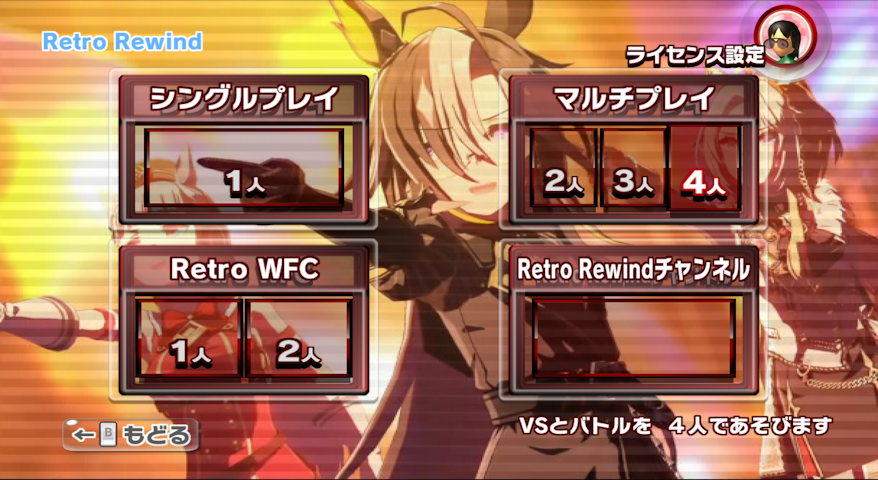
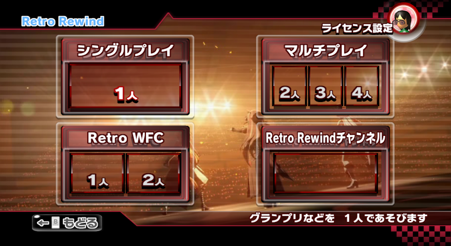

# Retro Rewind UI仕様まとめ
最終更新日: 2025年9月5日

## この記事の対象者
- Retro Rewindでアセット編集を行いたい方
- 内部情報を知りたい方

## v6.3のアップデートでUI面に大きな変更
2025/09/05にRetro Rewindがv6.3にアップデートされました。バトルモードやアイテムレイン野良などが実装されたりなど、やや大きめのアップデートが含まれます。\
この変更により、オンラインでのモード選択画面に変更が加わったため一部サブファイル(BRLYT)などをそのまま使用することができなくなりました。

## UIの変更点まとめ
### 変更前のAssetsフォルダに入っていたもの
以下3点のszsについて、ここでは**補完アセット**と呼びます。
```
RetroRewind6
└── Assets
    └── CommonAssets.szs (Common.szsの補完)
        RaceAssets.szs (Race.szsの補完)
        UIAssets.szs (UI関連ファイルの補完)        
```
いずれもmkw標準の`SZS`ファイルに含まれていないファイルを補完するために存在しています。\
仕様としては以下のような感じです。
1. mkw標準のSZSファイル内に必要なサブファイル(`brlyt`など)があるかチェック。
2. もし含まれているならmkw標準のファイルを利用
3. もし含まれていないなら**補完アセット**から読み込む

これにより、特定のディストリビューションごとにszsを作る必要がないので便利です。

### 変更後(v6.3以降)のAssetsフォルダに入っていたもの
既存の補完アセットに加えて、`ReplacedAssets.szs`が入っています。
```
RetroRewind6
└── Assets
    └── CommonAssets.szs
        RaceAssets.szs
        ReplacedAssets.szs (今回追加されたもの)
        UIAssets.szs
```

### ReplacedAssetsは何者?
ざっくりいうと、何が何でもサブファイルを置き換える役割を担っています。

アプデによって仕様も変更になっています。
1. mkw標準のSZSファイル内に必要なサブファイル(`brlyt`など)があるかチェック。
2. もし含まれているならmkw標準のファイルを利用
3. もし含まれていないなら**補完アセット**から読み込む
4. 1-3で反映されたサブファイルの中で、`ReplacedAssets.szs`に含まれているサブファイルに置き換える。

変更前と比較すると4が追加されたことだけでも覚えてくれると嬉しいです。\
言語化が難しいですが、具体例を見ながらお話したいと思います。

## v6.3にアプデしたらテクハしているのに上下の帯が透明になった


読者の中には、上の見出しのような問題に直面した方もいるでしょう。\
この問題は、先ほどの`ReplacedAssets`の仕様を理解するためには十分な事例だと思います。ぜひお読みいただければと思います。

### 原因の概要
    ReplacedAssetsの中に透明化を行うtplファイルが入っていたから。

### 詳細
`wszst`などで展開してみると、以下のような構造になっています。ここでは、`bg`以外のフォルダの中身については割愛しています。
```
ReplacedAssets.d
|   wszst-setup.txt
|   
+---bg
|   +---ctrl
|   |       MenuObiBottom.brctr
|   |       
|   \---timg
|           ht_squareWhite_00.tpl
|           tt_block_16x16.tpl
|           tt_go_obi_top_waku.tpl
|           tt_obi_bottom_curve_000.tpl
|           tt_obi_bottom_left_000.tpl
|           tt_obi_bottom_right_000.tpl
|           tt_obi_check_000.tpl
|           tt_obi_top_curve_000.tpl
|           tt_obi_top_left_000.tpl
|           tt_obi_top_right_000.tpl
|           tt_pattern_chek_alpha_nasi_32x32.tpl
|           tt_pattern_chek_bokashi_32x32.tpl
|           
+---button         
+---control  
\---press_start
```
読者の大半は理解していそうですが、ここには上下の帯や背景に関連するファイルを格納されています。\
tplを開いて確認すると、案の定透明化されていました。このファイルを弄ってあげれば問題は解決できそうです。

### 解決方法
    ReplacedAssets.d内のbgフォルダを削除する。

先ほどの仕様を思い出してみましょう。
> 4. 1-3で反映されたサブファイルの中で、`ReplacedAssets.szs`に含まれているサブファイルに置き換える。

この事例から考えると、mkw標準のSZSと`ReplacedAssets.szs`に同じサブファイルがある場合は、後者が優先されることが理解できると思います。

この仕様を理解できたら解決方法は単純です。`ReplacedAssets.szs`から上書きされるファイルを削除すればよいわけです。帯の透明化を防ぎたい場合は、`bg`フォルダを削除して`wszst`で圧縮すればよいですね。

### 反映結果の確認


これで、今まで通り上下の帯が反映されるようになりました。

### 余談
今回は`ReplacedAssets.szs`の編集についてまとめました。\
このファイルは、My Stuffからも読み込むことができるので、パック内のAssetsフォルダで直接作業するよりは、別のフォルダに移して編集しMy Stuffに入れるとよいと思います。